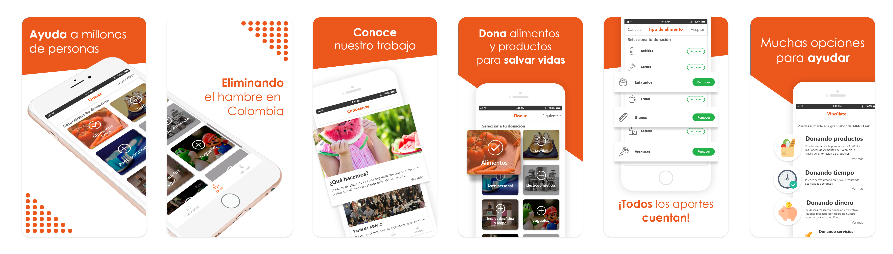

## Nombre del proyecto

ABACO

# 
El banco de alimentos (**ABACO**) es una organización que promueve y recibe donaciones con el propósito de darles de comer a miles de personas que padecen hambre en Colombia.

## Motivación
Dar a conocer a la fundación por medio de la aplicación móvil e incentivar las donaciones.

## Screenshots
# 

## Frameworks usados
**Construido con:**
- Ionic

## Contacta a la fundación en Cali:

- Dirección: Cl. 24 #6-103. Cali.
- Teléfono: 57-2-881-2066
- Email: info@bancodealimentoscali.org
- Sitio web: http://www.bancodealimentoscali.org/

## Autores

- Juan Felipe Delgado Vargas - https://github.com/jfdelgadovargas
- Brandon Lecklerh Solarte Melenje - https://github.com/BrandonLeck
- Andrés Felipe Vásquez Castrillón - https://github.com/andresfelipevasquez

## Licencia
MIT
